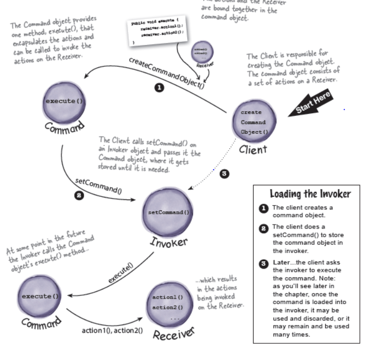

statement:
Design the API for our new Home Automation
Remote Control. Remote control features seven programmable slots (each
can be assigned to a different household device) along with
corresponding on/off buttons for each. The remote also has
a global undo button.
