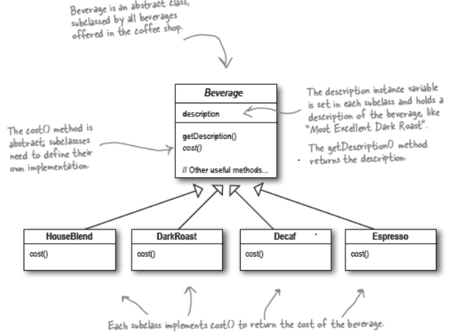
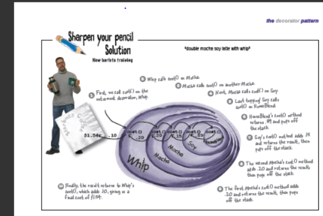

statement:
Starbuzz Coffee has made a name for itself as the fastestgrowing
coffee shop around. If you’ve seen one on your local
corner, look across the street; you’ll see another one.
Because they’ve grown so quickly, they’re scrambling to update
their ordering systems to match their beverage offerings.

principle:
1. Classes should be open
   for extension, but closed for
   modification.

pattern:
The Decorator Pattern attaches additional
responsibilities to an object dynamically.
Decorators provide a flexible alternative to
subclassing for extending functionality.