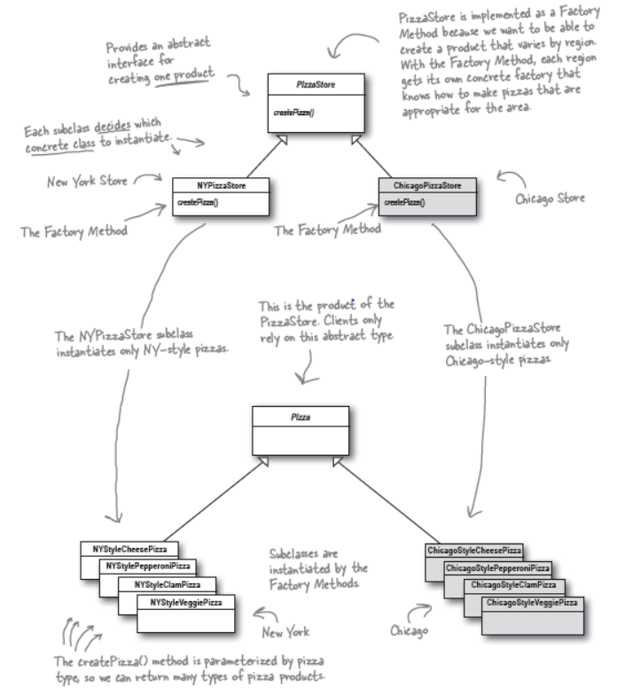
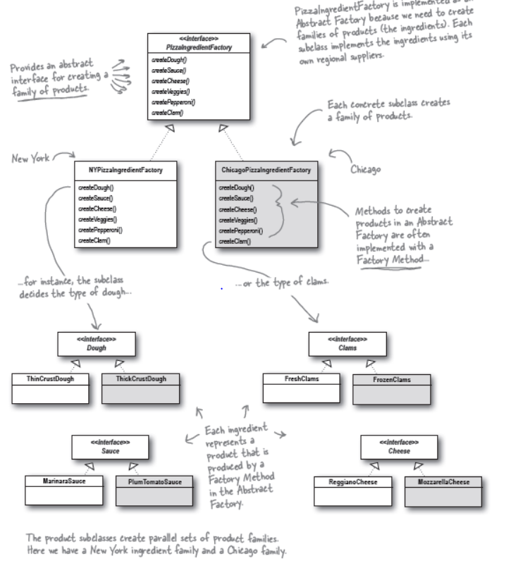

statements:
create a pizza store and factory , client should be able to create order pizzas from the pizza stores. 
can make a franchize out of it .

patterns:
1. A factory method handles object creation and encapsulates it in a
    subclass. This decouples the client code in the superclass from the
    object creation code in the subclass.
                              
2. The Abstract Factory Pattern provides an interface
   for creating families of related or dependent objects
   without specifying their concrete classes.

principles:
1. Depend upon abstractions , Do not depend upon concrete classes.
2. the Dependency Inversion Principle makes an even
   stronger statement about abstraction. It suggests that our
   high-level components should not depend on our low-level
   components; rather, they should both depend on abstractions.

final Design:

extra work:
