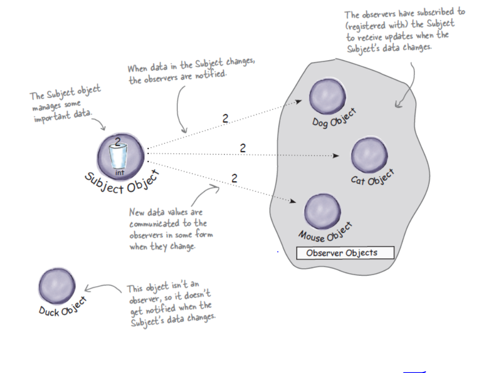

statement:
The weather station will be based on our patent pending
WeatherData object, which tracks current weather conditions
(temperature, humidity, and barometric pressure). We’d like
you to create an application that initially provides three display
elements: current conditions, weather statistics, and a simple
forecast, all updated in real time as the WeatherData object
acquires the most recent measurements.
Further, this is an expandable weather station. Weather-ORama
wants to allow other developers to write their own
weather displays and plug them right in. So it’s important that
new displays will be easy to add in the future.

devices ---- weather station -- weatherdata object --- display devices

-- use of news paper subscription

pattern:
The Observer Pattern defines a one-to-many
dependency between objects so that when one
object changes state, all of its dependents are
notified and updated automatically.

principles :
1. Strive for loosely coupled designs
between objects that interact.

